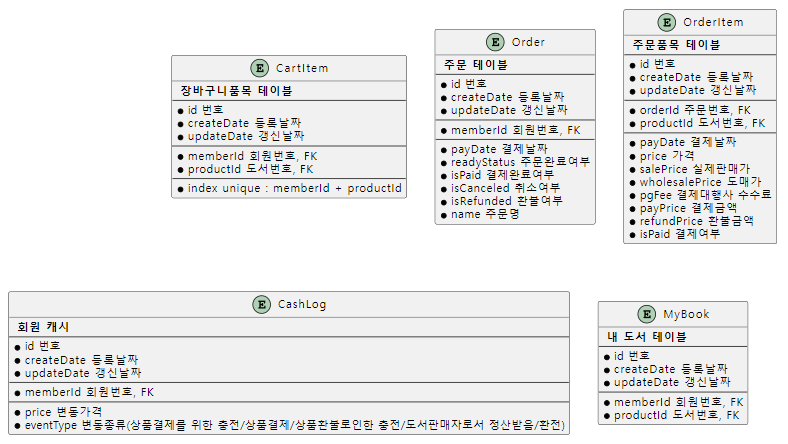

## Title: [2Week] 이승훈

### 미션 요구사항 분석 & 체크리스트
- 2022-10-24 -10:00 ~ 10-26 -18:00
---
**필수 과제**

- [x]  주문
- [x]  결제
- [x]  장바구니
- [x]  PG 연동

**추가 과제**

- [x]  환불

### 2주차 미션 요약
### 장바구니

- [x] 도서를 장바구니에 담을 수 있다.
  -  [x] 여러 종류의 도서를 장바구니에 담을 수 있다.
  - [x] 하나의 도서는 한가지만 담을 수 있다.
  - [x] 자신이 작성한 도서는 담을 수 없다.
- [x] 장바구니에서 도서를 제거할 수 있다.
- [x] 장바구니에 담긴 도서들을 가지고 주문을 할 수 있다.

### 주문

- [x] 도서 주문
  - [x] 주문을 하면 일단 주문의 상태는 준비상태이다.
    - [x] 여기서 결제를 하거나 주문 취소를 할 수 있다.
    - [x] 주문을 취소하면 해당 주문은 삭제된다.
    - [x] 결제 중 페이지를 이동하면 해당 주문은 준비상태를 유지한다.

### 결제 및 캐시로그

- [x] 주문 준비 상태에서 결제를 할 수 있다.
  - [x] 결제를 할 때 기존에 소유하고 있는 캐시(예치금)을 사용할 수 있다.
  - [x] 결제는 토스 페이먼츠를 이용하여 카드 결제를 구현한다.
  - [x] 예치금+카드 또는 예치금 결제, 카드 결제가 가능하다.
- [x] 결제가 완료되면 MyBook 테이블에 구매된 책이 추가되어야 한다.
- [x] 모든 현금 흐름은 CashLog에 기록된다.
  - [x] CashLog 테이블은 사이버 머니에 대한 기록 테이블이다.
  - [x] 결제를 하게 되면 CashLog 테이블에 돈이 충전된 후 바로 사용된다.

### 환불

- [x] 주문 상태인 물품은 결제가 가능하고, 결제된 상품은 환불이 가능하다.
  - [x] 결제 후 10분 이내에 환불 할 수 있다.
---

### ERD

---
**[접근 방법]**
- 프론트에서의 로직을 최대한 줄이고 스프링 단에서 해당 로직을 처리한다.
- 목표했던 기능이 정상적으로 수행되는지를 우선적으로 판단하여 개발하고 추후 리팩토링을 진행한다.
- Ui 작업의 시간을 최소화하기 위해 이전에 사용한 Ui 템플릿을 사용한다.
- 빈 충돌이 나지 않게 로직의 흐름이 단방향으로 흐를 수 있도록 유의하며 설계한다.
- 주어진 ERD를 참고하여 DB를 설계하되 필요 시 수정한다.

**[결과물]**

- 사용자는 여러가지 글을 작성할 수 있다.
- 사용자는 작가명을 등록하고 도서를 등록할 수 있다.
  - 글을 등록할 때 여러 가지 글을 추가하여 등록할 수 있다. 
- 자신이 작성하지 않은 도서를 구매할 수 있다.
  - 구매할 도서를 장바구니에 추가할 수 있다.
    - 장바구니에서 구매할 도서만 선택해서 주문이 가능하다.
    - 도서 주문 및 결제, 10분 이내 환불이 가능하다.
    - 결제는 예치금 또는 토스페이먼츠 카드 결제로 가능하다.
    - 모든 현금 흐름은 CashLog에 기록된다.
- 내 도서 목록에는 결제를 마친 도서와 내가 작성한 도서를 확인할 수 있다.
  - 도서 안에 내용은 결제한 사용자만이 확인이 가능하다.

- 주문 목록에는 결제된 도서는 환불 기능, 결제 준비중인 도서는 결제 기능이 있다.
  - 환불은 결제시간에서 10분 이내만 가능하다.
  - 결제 준비중인 도서는 주문 취소가 가능하다.

**[특이사항]**
- 사용자는 장바구니에 같은 종류의 도서를 담을 수 없습니다.
- 하지만 기존에 구매한 도서를 장바구니에 담을 수 없다는 조건은 없었습니다.
- 따라서 확장성을 고려하여 MyBook 테이블에 수량을 뜻하는 number 필드를 추가하여 사용자가 보유한 해당 종류의 도서 갯수를 포함했습니다.
- 장바구니에 같은 도서를 여러개 담을 수 없지만 결제 후 기존 도서가 있다면 수량을 하나 증가시켰습니다.
- MyBook에 도서 리스트를 추가할 때 각 도서가 이미 내가 가지고 있는 도서인지 체크하기 위해 도서 수 만큼 매번 DB에 쿼리를 날리는 작업을 하게 되는데 DB 접근이 더 효율적인 방법을 고려하고 있습니다.

[Refactoring]
  - 내가 보유한 도서 종류 수량 기능 
    - DB 접근을 최소화하기 위한 작업
  - 각 레이어 층에 맞는 역할을 수행하도록 주의
  - 데이터를 주고 받을 때 dto를 활용할 수 있도록
  - 기능 개발을 종료한 후 흐름이 얽히는 부분이 있는지 천천히 읽어보고 진행합니다.
  - 피어리뷰를 통해 전달받은 다양한 의견과 피드백을 조율하여 진행합니다.
