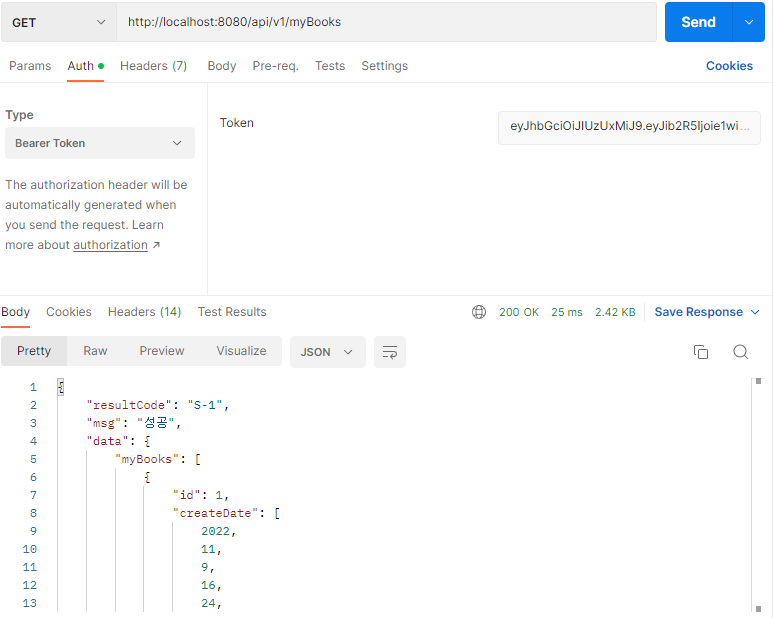

## 도서 쇼핑몰 MUT BOOK

### 📣 주제
**v1. WEB (1~3week_Mission)**

사용자는 여러 글을 생성할 수 있고 원하는 글을 조합하여 도서를 생성할 수 있다. 도서를 장바구니에 추가한 이후 주문이 가능하며  구매는 토스 페이먼츠 결제 또는 예치금 결제로 이루어진다. 결제 후 10분 이내 환불이 가능하다.

매달 15일 새벽 4시 정산 데이터는 배치로 만들어지며 관리자는 정산 데이터 처리와 출금 처리 기능 있다. 모든 현금 기록은 CashLog에 기록된다.

**v2. REST API(4week_Mission)**

CSR 통신을 위한 REST API 구현으로 사용자 로그인에 따라 Access Token을 발급한다.

사용자가 요청과 함께 토큰을 보내면 유효한 토큰인지 판별하고 정보를 제공한다
### 📣 구현 기능

#### 회원 관리<br/>
- 회원 가입, 회원 정보 수정, 로그인, 로그아웃, 아이디 찾기, 비번 찾기
- 작가 등록

#### 글
- 글 작성, 글 수정, 글 리스트, 글 삭제

#### 도서
- 도서 등록, 도서 수정, 도서 리스트, 도서 상세 페이지

#### 해시태그
- 글 해시태그와 도서 해시태그를 구분하는 중간테이블 따로 관리

#### 장바구니
- 장바구니 추가, 장바구니 삭제 

#### 주문
- 장바구니에 포함된 도서 주문 아이템 생성, 주문 취소

#### 결제 및 PG 연동
- 토스페이먼츠 활용
- 도서 주문 및 환불
- 예치금 입금, 출금 신청
- 모든 현금 흐름은 CashLog에 기록

#### 관리자
- 정산
  - 매달 15일 4시 정산 데이터 생성
- 출금
  - 출금 신청 처리

#### CSR 통신 - REST API
- JWT 로그인 구현
  - 임의의 계정 생성 후 로그인 시 AccessToken 발급
- 로그인 한 회원의 정보 구현
  - 발급받은 AccessToken을 요청에 실어 보내 회원 정보를 볼 수 있다.
- 내 도서 리스트, 상세 정보
- Spring Doc으로 API 문서화

### 📣 사용 기술
#### 백엔드
- SpringBoot v5.3.23
- Spring Security
- Spring Batch, Scheduler
- Spring Doc (Swagger)
- JWT
- JPA, queryDSL
- toss payments
- Google SMTP (gmail)
- Redis

#### 프론트
- html, css, javascript
- tymeleaf
- TailWind CSS
- CKeditor


#### Database
- mysql v2.18.1


### 📣 결과물

## WEB
#### **메인페이지**


#### **로그인**


#### **회원 가입**


#### **ID, PW찾기**


#### **회원 정보**


#### **예치금 충전**


#### **출금 신청**


#### **글 등록**


#### **도서 등록**


#### **장바구니 담기**


#### **주문 상세**


#### **괸리자 정산**


#### **괸리자 출금 처리**


## REST API
#### **로그인**


#### **내 정보**


#### **내 도서 리스트**



#### **내 도서 상세**


### **캐시에 로그인 유저 저장**


[//]: # (---)

[//]: # ()
[//]: # (### 코드리뷰 체크리스트)

[//]: # ()
[//]: # (- [ ]  구현한 로직 상에서 오류가 날 수 있는 부분은 없는지)

[//]: # (- [ ]  변수, 클래스, 메소드 등에 명확한 이름을 선택했는지)

[//]: # (- [ ]  주석이 없어도 네이밍이 명확한데 필요 없는 주석이 있는지)

[//]: # (- [ ]  코드가 필요 이상으로 복잡하지 않은지)

[//]: # (- [ ]  유닛 테스트가 적절한지)

[//]: # (- [ ]  리뷰어는 **모든 줄을 리뷰**하고, 전체적인 **문맥**을 살피고, **코드 품질을 개선**시키고, 작성자가 **잘한 점**은 꼭 칭찬한다.)

[//]: # (- [ ]  스타일 가이드를 잘 지켰는지)

[//]: # ()
[//]: # (### 코드 리뷰 방식)

[//]: # ()
[//]: # (1. 브랜치를 따로 만들어 master 브랜치에 PR을 날린다.)

[//]: # (    - 예시: [Github Flow 방법]&#40;https://www.notion.so/Github-Flow-7b5aac93b5be4c648449cec6367a34be&#41;)

[//]: # (    - 이슈나 브랜치 규칙명은 개인적으로 정함)

[//]: # (2. 코드 리뷰 방법)

[//]: # (    - 예시: [코드 리뷰 예시]&#40;https://www.notion.so/4b16088e25924cd7a9304ee7ada82dd6&#41;)

[//]: # (    - 각 팀원별 레포지터리 PR 안에서 코드리뷰 진행)

[//]: # ()
[//]: # (### 코드 컨벤션)

[//]: # ()
[//]: # (1. **중괄호 규칙**)

[//]: # (   - 줄의 마지막에서 시작 중괄호`{`를 쓰고 열고 새줄을 삽입한다. 블럭을 마친후에는 새줄 삽입 후 중괄호를 닫는다.)

[//]: # (   - 조건, 반복문이 한 줄로 끝더라도 중괄호를 활용한다.)

[//]: # (   - 예시)

[//]: # ()
[//]: # (       ```java)

[//]: # (       **public class SearchConditionParser {)

[//]: # (           public boolean isValidExpression&#40;String exp&#41; {)

[//]: # (       )
[//]: # (               if &#40;exp == null&#41; {)

[//]: # (                   return false;)

[//]: # (               })

[//]: # (       )
[//]: # (               for &#40;char ch : exp.toCharArray&#40;&#41;&#41; {)

[//]: # (                   ....)

[//]: # (               })

[//]: # (       )
[//]: # (               return true;)

[//]: # (           })

[//]: # (       }**)

[//]: # (       ```)

[//]: # ()
[//]: # (2. **변수명은 한글소리 그대로 적지 말기**)

[//]: # (   - 나쁜 예시)

[//]: # ()
[//]: # (     `moohyungJasan`&#40;무형자산&#41;)

[//]: # ()
[//]: # (   - 좋은 예시)

[//]: # ()
[//]: # (     `intangibleAssets`&#40;무형자산&#41;)

[//]: # ()
[//]: # (3. **규칙명 &#40;네이밍&#41;**)

[//]: # (   - 클래스는 명사)

[//]: # (   - 메서드는 동사, 전치사로 시작)

[//]: # ()
[//]: # (### 우리 팀의 1인당 코드 리뷰 최소 시간은?)

[//]: # ()
[//]: # (---)

[//]: # ()
[//]: # (팀원당 **`최소 15분`**, 많게는 30분을 투자해 코드리뷰 진행)

